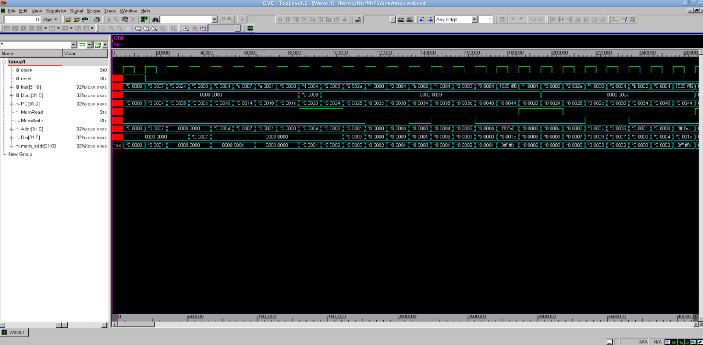
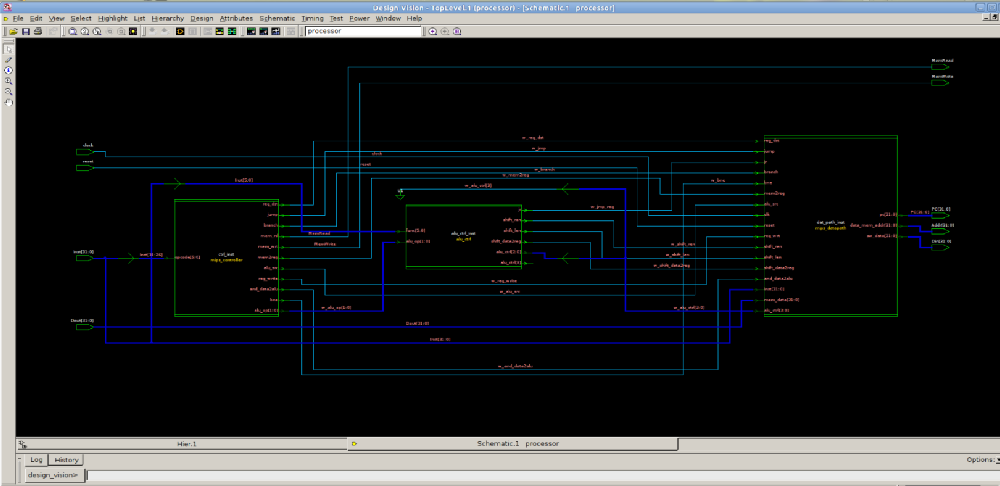
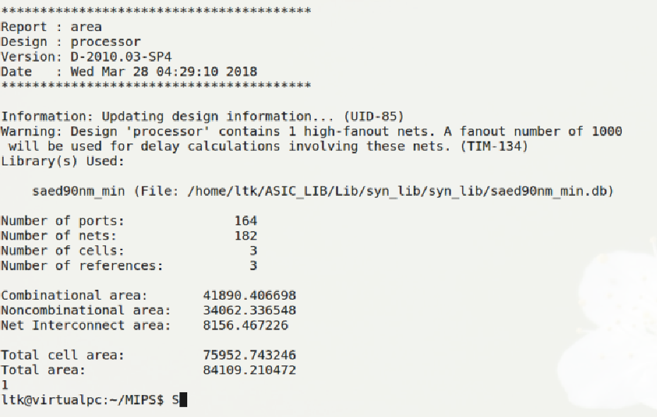
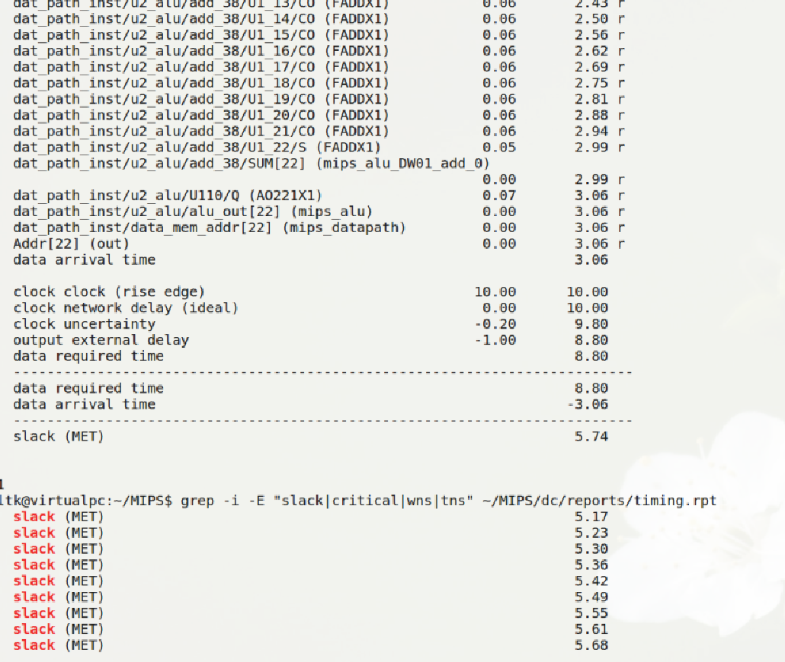
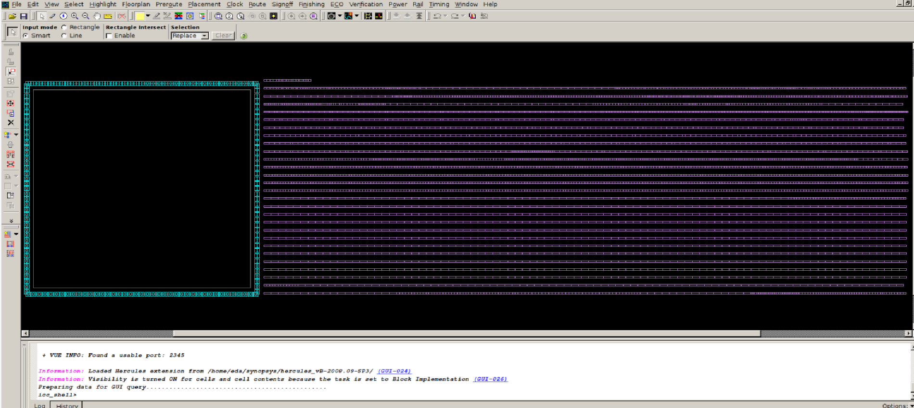
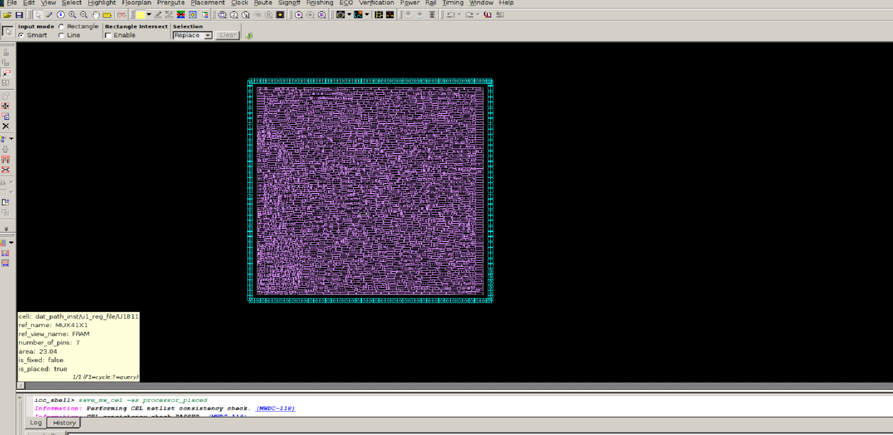
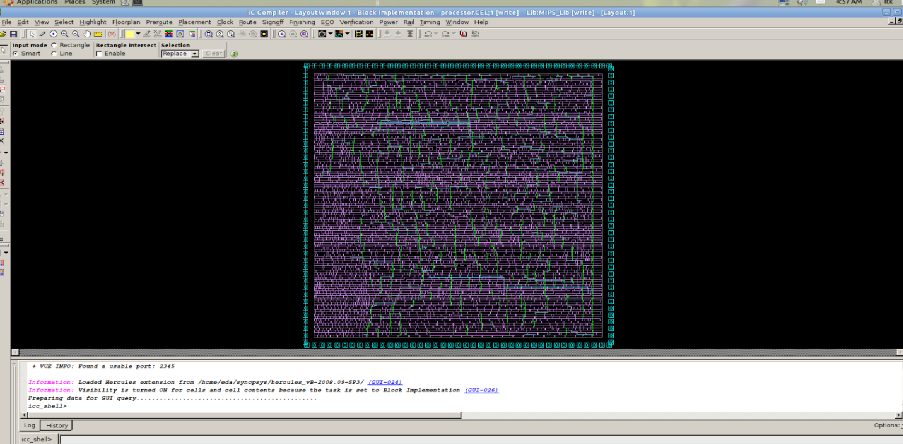
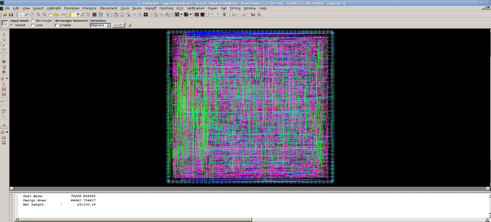
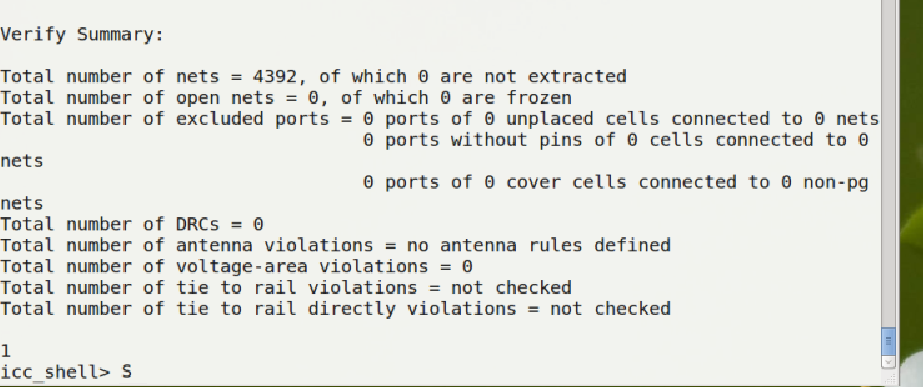
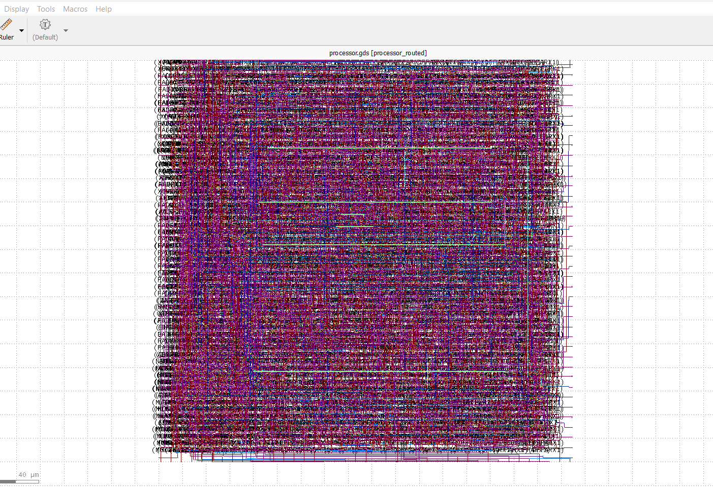

# MIPS Processor — ASIC Physical Design Full Flow

A 32-bit MIPS processor implemented in Verilog and taken through a complete ASIC physical design flow using Synopsys tools.

---

## 1. Project Overview

This project demonstrates the implementation of a MIPS processor from RTL design to physical implementation.

The complete ASIC design flow includes:

**RTL → Simulation → SDC → Synthesis → Floorplan → Placement → CTS → Routing → STA → GDS**

The design was implemented using a **90 nm standard-cell technology library**.

---

## 2. Design Flow

```text
RTL Design
    │
    ▼
VCS Simulation
    │
    ▼
SDC Timing Constraints
    │
    ▼
Design Compiler
    │
    ├── Logic Synthesis
    ├── Area Analysis
    └── Timing Analysis
    │
    ▼
IC Compiler
    │
    ├── Floorplanning
    ├── Placement
    ├── Clock Tree Synthesis
    └── Routing
    │
    ▼
PrimeTime
    │
    ├── Setup Analysis
    └── Hold Analysis
    │
    ▼
Final GDS
```

## 3. RTL Design

The processor is described using Verilog RTL.

Main RTL blocks include:

* ALU
* Register File
* Controller
* Datapath
* Shifter
* CPU Top Module

Top-level module:

```text
processor
```

---

## 4. RTL Simulation

RTL simulation was performed using **Synopsys VCS**.

The testbench verifies the functional behavior of the MIPS processor before synthesis.

### Simulation Waveform



---

## 5. Logic Synthesis

Logic synthesis was performed using **Synopsys Design Compiler**.

The RTL was synthesized into a gate-level netlist using the SAED 90 nm standard-cell library.

### Gate-Level Schematic



### Area Report



### Timing Report



Generated netlist:

```text
netlist/mips_NL.v
```

---

## 6. Physical Design

Physical implementation was performed using **Synopsys IC Compiler**.

### Floorplanning

A core utilization of approximately **70%** was used for the initial floorplan.



---

### Placement

Standard cells were placed inside the core area while considering timing and routing constraints.



---

### Clock Tree Synthesis

Clock Tree Synthesis (CTS) was performed to distribute the clock signal across the design.



After CTS:

| Parameter                   |   Result |
| --------------------------- | -------: |
| Clock Period                |    10 ns |
| Setup Slack                 | +3.02 ns |
| TNS                         |     0 ns |
| Violating Paths             |        0 |
| Hold Violation              |        0 |
| Leaf Cells                  |    4,209 |
| Clock Buffer/Inverter Cells |        6 |

---

### Routing

Global and detailed routing were performed using IC Compiler.

After routing:

| Parameter              |   Result |
| ---------------------- | -------: |
| Setup Slack            | +3.24 ns |
| Total Negative Slack   |     0 ns |
| Violating Paths        |        0 |
| Routing Net Violations |        0 |




## 7. Physical Verification

Design Rule Checking verifies whether the physical layout follows the technology design rules.



## 8. Final Layout

The final routed design was exported as a **GDSII** file.

```text
processor.gds
```

### Final Layout



---

## 9. Key Results

| Parameter              |     Result |
| ---------------------- | ---------: |
| Technology             | SAED 90 nm |
| Clock Period           |      10 ns |
| Clock Frequency        |    100 MHz |
| Core Utilization       |       ~70% |
| CTS Setup Slack        |   +3.02 ns |
| CTS Hold Violation     |          0 |
| Routed Setup Slack     |   +3.24 ns |
| Total Negative Slack   |          0 |
| Routing Net Violations |          0 |
